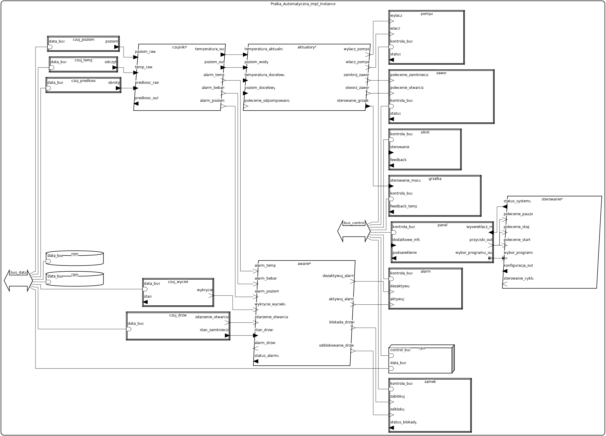
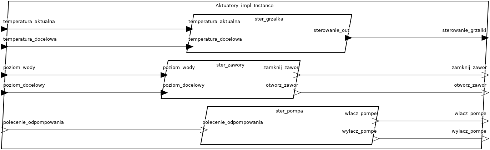
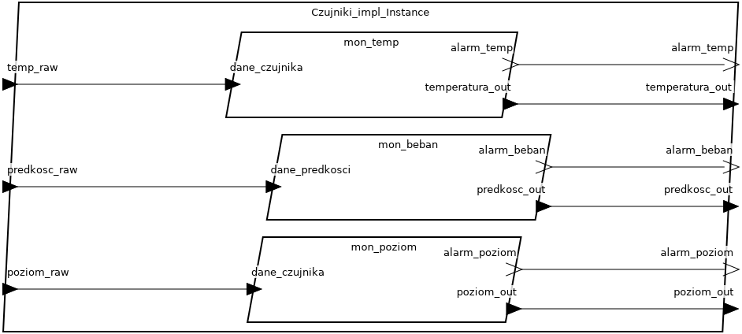
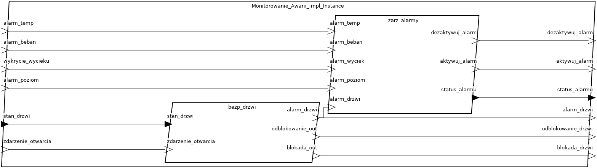
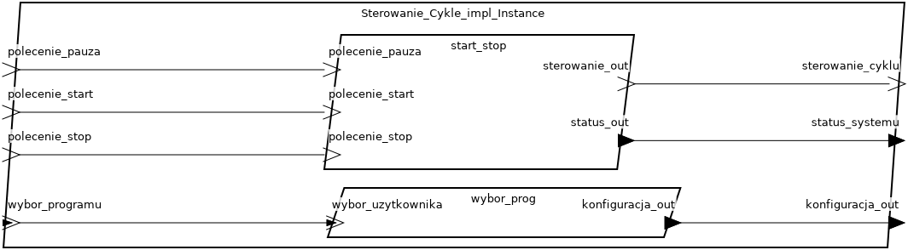

# Projekt Pralka Automatyczna w AADL - Systemy Czasu Rzeczywistego

Projekt realizowany w ramach przedmiotu **Systemy Czasu Rzeczywistego**, polegający na modelowaniu architektury pralki automatycznej przy użyciu języka **AADL** (Architecture Analysis & Design Language) w narzędziu **OSATE2**.

## Autor
- Jan Majchrowicz
   - GitHub: [GitHub/majchjan](https://github.com/majchjan)  
   - Email: majchrowiczj@student.agh.edu.pl

## Opis systemu

### Opis ogólny
Model przedstawia system pralki automatycznej, który umożliwia realizację różnych programów prania (np. bawełna, syntetyki, delikatne) oraz monitoruje i steruje procesem prania w czasie rzeczywistym. System składa się z komponentów sprzętowych (czujniki, aktuatory, procesor, pamięć) oraz oprogramowania (procesy i wątki zarządzające funkcjami pralki). Model został zaimplementowany w języku AADL przy użyciu narzędzia OSATE2.

### Opis dla użytkownika
Pralka automatyczna oferuje następujące funkcje:

### Wymagania funkcjonalne:
   1. Wybór programu prania:
      - System oferuje 5 programów prania: "Bawelna", "Syntetyki", "Delikatne", "Szybkie", "Wirowanie".
      - Użytkownik wybiera program za pomocą panelu sterowania.

   2. Sterowanie procesem prania:
      - Możliwość uruchomienia prania (przycisk Start).
      - Zatrzymanie prania w dowolnym momencie (przycisk Stop).
      - Funkcja Pauza do tymczasowego zatrzymania cyklu.

   3. Monitorowanie parametrów:
      - Ciągły pomiar temperatury wody z tolerancją ±1°C.
      - Kontrola poziomu wody w zbiorniku.
      - Monitorowanie prędkości obrotowej bębna.

   4. Bezpieczeństwo:
      - Automatyczna blokada drzwi podczas pracy.
      - Wykrywanie wycieków wody i natychmiastowe zatrzymanie procesu.
      - Alarm dźwiękowy w przypadku awarii (np. przegrzanie, otwarcie drzwi).

   5. Wyświetlanie statusu:
      - System informuje o aktualnym stanie (np. "Pranie", "Plukanie", "Awaria") na panelu sterowania.

   6. Sterowanie urządzeniami wykonawczymi:
      - Regulacja mocy grzałki w zależności od temperatury docelowej.
      - Sterowanie zaworami wody i pompą odpływową.
      - Kontrola kierunku i prędkości obrotów silnika bębna.

### Wymagania niefunkcjonalne:
   1. Wymagania czasowe:
      - Czas reakcji na awarię (np. wyciek): ≤ 50 ms.
      - Okres monitorowania temperatury: 1000 ms.
      - Okres monitorowania poziomu wody: 500 ms.

   2. Niezawodność:
      - System musi działać bezawaryjnie przez ≥ 10 000 cykli prania.
      - Automatyczne przejście w stan "Awaria" w przypadku krytycznych błędów.

   3. Wydajność energetyczna:
      - Maksymalne zużycie energii: ≤ 8000 mW (wszystkie komponenty).
      - Tryb oszczędzania energii w stanie "Bezczynny".

   4. Bezpieczeństwo:
      - Blokada drzwi musi być aktywna podczas pracy silnika lub przy wysokiej temperaturze.
      - System musi spełniać normy ochrony przeciwporażeniowej (izolacja grzałki).

   5. Ograniczenia sprzętowe:
      - Pojemność pamięci RAM: ≥ 8 MB.
      - Pojemność pamięci ROM: ≥ 4 MB.
      - Waga całkowita systemu: ≤ 5 kg.

   6. Kompatybilność:
      - Magistrala danych (Bus_Data) musi obsługiwać przepustowość ≥ 1000 KB/s.
      - Magistrala sterująca (Bus_Control) musi obsługiwać ≥ 500 KB/s.

   7. Wymagania dotyczące oprogramowania:
      - Priorytety wątków muszą być ściśle przestrzegane (np. Bezpieczenstwo_Drzwi ma najwyższy priorytet = 10).
      - Dane sensorowe muszą być aktualizowane w czasie rzeczywistym.

   8. Interfejs użytkownika:
      - Panel sterowania musi być intuicyjny (min. 3 przyciski: Start/Stop/Pauza + wybór programu).
      - Sygnalizacja dźwiękowa alarmu musi być słyszalna z odległości ≥ 3 metrów.

## Główne komponenty (AADL)

1. **System** `Pralka_Automatyczna` – główny komponent zarządzający. Zarządza komunikacją między komponentami.

2. **Wątki i procesy**:

   * **Wybor_Programu**: Obsługuje wybór programu prania przez użytkownika i przekazuje odpowiednią konfigurację systemowi.
   * **Start_Stop_Pauza**: Odpowiada za odbieranie poleceń użytkownika (start, stop, pauza) i przekazywanie sygnałów sterujących cyklem prania oraz statusu systemu.
   * **Monitor_Poziomu_Wody**: Okresowo monitoruje poziom wody na podstawie danych z czujnika oraz generuje alarmy przy nieprawidłowych wartościach.
   * **Monitor_Temperatury**: Cyclicznie mierzy temperaturę w systemie, przekazuje dane oraz sygnalizuje przekroczenie progów alarmowych.
   * **Monitor_Bebna**: Śledzi prędkość obrotową bębna i informuje o możliwych przeciążeniach lub awariach.
   * **Bezpieczenstwo_Drzwi**: Obsługuje czujniki stanu drzwi, reaguje na otwarcie drzwi i generuje sygnały blokujące lub odblokowujące oraz alarmowe.
   * **Sterowanie_Grzalka**: Reguluje pracę grzałki w oparciu o aktualną i docelową temperaturę.
   * **Sterowanie_Zawory**: Steruje zaworami napełniającymi wodę w zależności od aktualnego i docelowego poziomu.
   * **Sterowanie_Pompa**: Odpowiada za uruchamianie i zatrzymywanie pompy odpompowującej wodę.
   * **Zarzadzanie_Alarmami**: Centralny wątek przetwarzający alarmy z różnych źródeł (temperatura, poziom wody, bęben, drzwi, wyciek) i zarządzający ich aktywacją/dezaktywacją.
   * **Wyswietlacz_Statusu**: Okresowo aktualizuje i prezentuje status systemu oraz bieżący czas działania.
   * **Sterowanie_Cykle**: Główny proces odpowiedzialny za koordynację cyklu prania, integruje wybór programu i sterowanie start/stop.
   * **Czujniki**: Proces grupujący wątki monitorujące (temperaturę, poziom wody, prędkość bębna) oraz przesyłający dane i alarmy do dalszej obróbki.
   * **Aktuatory**: Proces skupiający elementy wykonawcze: grzałkę, zawory i pompę – odpowiada za fizyczne sterowanie urządzeniem.
   * **Monitorowanie_Awarii**: Integruje wątki związane z bezpieczeństwem i zarządzaniem alarmami, odpowiada za reakcję na sytuacje awaryjne oraz blokady zabezpieczające.

3. **Typy danych**:
   - **Typ_Programu**: Enum określający dostępne programy prania (np. "Bawelna", "Syntetyki").
   - **Dane_Sensorowe**: Struktura przechowująca dane z czujników (temperatura, poziom wody, prędkość bębna itp.).
   - **Status_Systemu**: Enum określający aktualny stan systemu (np. "Bezczynny", "Pranie", "Awaria").
   - **Dane_Sterujace**: Struktura przechowująca polecenia sterujące (moc grzałki, prędkość silnika itp.).
   - **Konfiguracja**: Struktura przechowująca parametry konfiguracyjne (czas prania, temperatura docelowa itp.).

4. **Urządzenia**:
   - **Silnik_Bebna**: Sterowanie prędkością i kierunkiem obrotów bębna.
   - **Zawor_Wlotowy**: Sterowanie dopływem wody.
   - **Grzalka_Wody**: Regulacja temperatury wody.
   - **Pompa_Wody**: Odpompowywanie wody.
   - **Elektrozamek_Drzwi**: Blokada drzwi podczas pracy.
   - **Alarm_Dzwiekowy**: Sygnalizacja awarii.
   - **Panel_Sterowania**: Interfejs użytkownika (wybór programu, przyciski sterujące).

5. **Czujniki**:
   - **Czujnik_Temperatury**: Pomiar temperatury wody.
   - **Czujnik_Poziomu_Wody**: Pomiar poziomu wody.
   - **Czujnik_Drzwi**: Monitorowanie stanu drzwi.
   - **Czujnik_Wyciekow**: Wykrywanie wycieków wody.
   - **Czujnik_Predkosci_Bebna**: Pomiar prędkości obrotowej bębna.

6. **Magistrale**:
   - **Bus_Data**: Magistrala danych dla czujników i pamięci.
   - **Bus_Control**: Magistrala sterująca dla urządzeń wykonawczych.

7. **Procesor i pamięć**:
   - **CPU_Main**: Główny procesor systemu.
   - **RAM**: Pamięć operacyjna.
   - **ROM**: Pamięć stała.

## Diagramy

### System Główny:

### Diagram procesu `Aktuatory`:

### Diagram procesu `Czujniki`:

### Diagram procesu `Monitorowanie_Awarii`:

### Diagram procesu `Sterowanie_Cykle`:

## Inne informacje
   - Model uwzględnia wymagania czasu rzeczywistego, takie jak okresowe monitorowanie parametrów i szybka reakcja na awarie.
   - System jest energooszczędny, co odzwierciedlają właściwości `SEI::PowerCapacity` dla urządzeń.
   - Model może zostać rozszerzony o dodatkowe funkcje, np. komunikację z aplikacją mobilną.

## Literatura
[https://mlodytechnik.pl/archiwum/04-2004_jak_dziala.pdf](https://mlodytechnik.pl/archiwum/04-2004_jak_dziala.pdf)

[https://pmc.ncbi.nlm.nih.gov/articles/PMC11672837/pdf/antibiotics-13-01227.pdf](https://pmc.ncbi.nlm.nih.gov/articles/PMC11672837/pdf/antibiotics-13-01227.pdf)

[https://pmc.ncbi.nlm.nih.gov/articles/PMC11664346/pdf/RA-014-D4RA07365G.pdf](https://pmc.ncbi.nlm.nih.gov/articles/PMC11664346/pdf/RA-014-D4RA07365G.pdf)

[https://antraks.pl/pl/p/file/ca14a55916d501e5474d2756800a0d97/ioWNPI94BSPL.pdf](https://antraks.pl/pl/p/file/ca14a55916d501e5474d2756800a0d97/ioWNPI94BSPL.pdf)

[https://www.euro.com.pl/artykuly/wszystkie/artykul-instrukcja-obslugi-pralki-wszystko-co-powinienes-wiedziec.bhtml](https://www.euro.com.pl/artykuly/wszystkie/artykul-instrukcja-obslugi-pralki-wszystko-co-powinienes-wiedziec.bhtml)

[https://api.amica.com.pl/pub-storage/pdm_IO/SER_0040935_ART.pdf](https://api.amica.com.pl/pub-storage/pdm_IO/SER_0040935_ART.pdf)
## Licencja
MIT